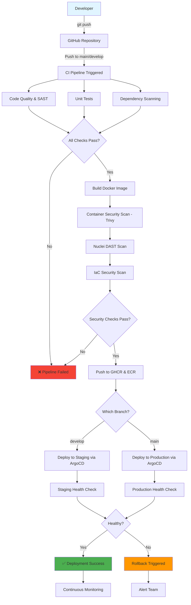
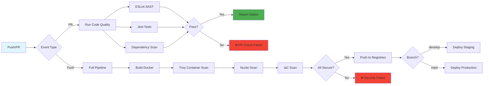
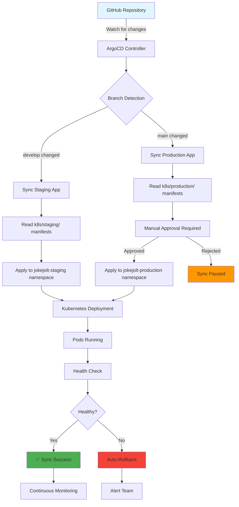
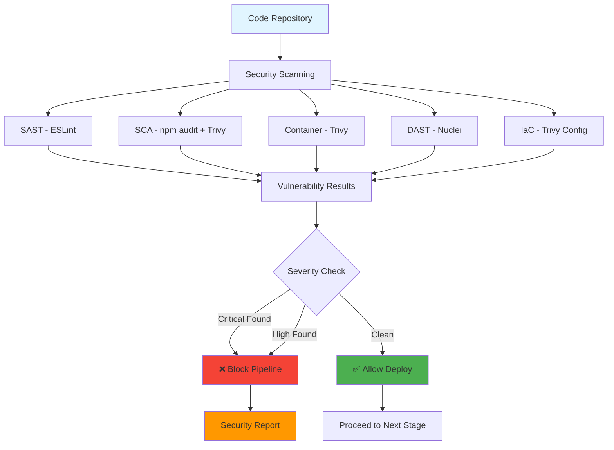
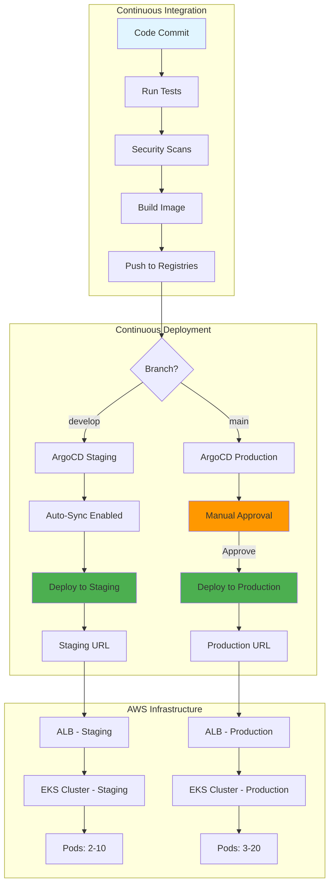
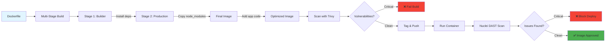
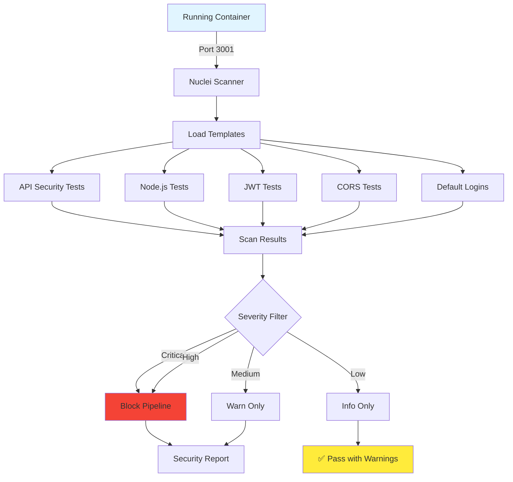
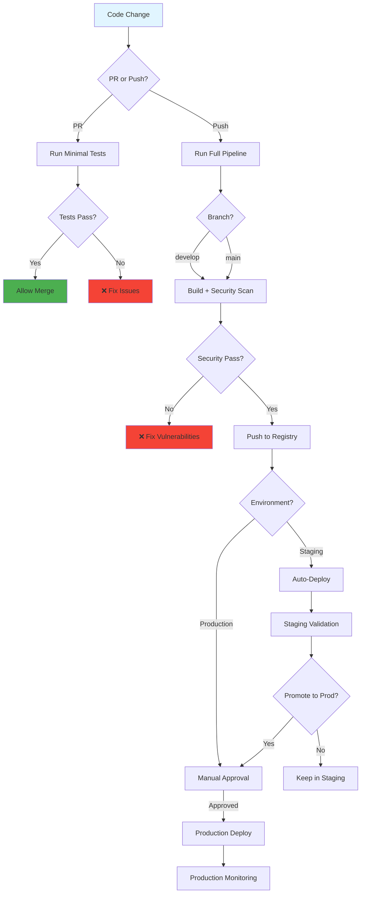

# CI/CD Pipeline Flow Diagrams

## Main Pipeline Flow



## GitHub Actions Workflow



## ArgoCD GitOps Flow



## Security Scanning Pipeline



## Multi-Environment Deployment



## Container Security Pipeline



## Nuclei Scan Details



## AWS Deployment Architecture

```mermaid
graph TB
    subgraph Registry["Container Registry"]
        A[GHCR] -->|Pull| B[AWS ECR]
    end

    subgraph EKS["Amazon EKS Cluster"]
        C[Worker Nodes] --> D[Pod 1]
        C --> E[Pod 2]
        C --> F[Pod 3]

        G[HPA] -->|Scale| C
    end

    subgraph Network["Networking"]
        H[ALB] -->|Route| I[Service]
        I --> D
        I --> E
        I --> F
    end

    B -->|Deploy| C
    H -->|Health Check| J[/health endpoint]

    J --> K{Status?}
    K -->|200 OK| L[✅ Healthy]
    K -->|Error| M[❌ Unhealthy]

    L --> N[Serve Traffic]
    M --> O[Rollback]

    style A fill:#e1f5ff
    style L fill:#4caf50
    style M fill:#f44336
```

## Pipeline Decision Tree



---

## Legend

| Symbol | Meaning |
|--------|---------|
| 🟦 Blue Box | External System/Actor |
| 🟩 Green Box | Success State |
| 🟥 Red Box | Failure State |
| 🟨 Yellow Box | Warning/Manual Action |
| 🟧 Orange Box | Waiting/Pending |

---

## How to View Diagrams

1. **GitHub**: Diagrams render automatically in markdown
2. **VS Code**: Install "Markdown Preview Mermaid Support" extension
3. **Online**: Use [Mermaid Live Editor](https://mermaid.live/)
4. **CLI**: Use `mmdc` (Mermaid CLI) to generate PNG/SVG

```bash
# Generate PNG from mermaid
npx @mermaid-js/mermaid-cli -i docs/PIPELINE-MERMAID.md -o pipeline.png
```
